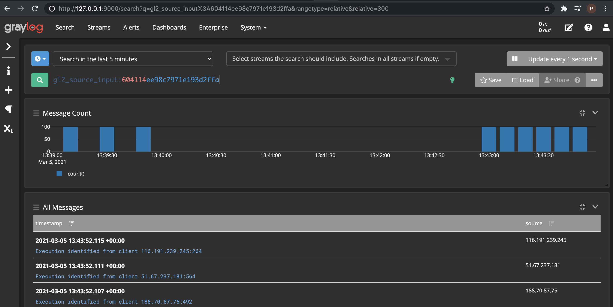
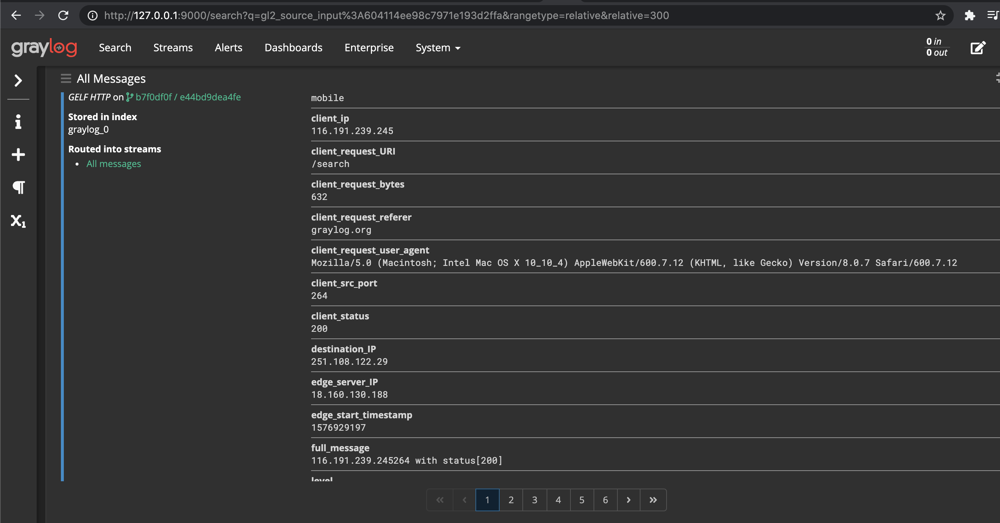

# Graylog command line publisher

## Overview
This project implements a command line application that reads events from a text file and publish them on Graylog by 
using the [GELF](https://docs.graylog.org/en/4.0/pages/gelf.html) message format.

## Technical implementation overview
The application relies on the following 2 features:
 - Parser 
   - in charge of parsing the file
   - Implemented in FileParser.java class 
 - Publisher
    - in charge of publishing an event into Graylog
    - Implemented in EventPublisher.java class 
  
The application solution is structured as follows:

1. Read the file from the file system
2. Parse the file by returning a list of Events
3. For each event:
    * convert the event to GELF format
    * Use /gelf API endpoint to publish the message on Graylog

## How to build the project?
The project can be build by executing:
    
     mvn clean install 

## How to execute the tests?
Tests are ran by executing:
         
          mvn test
          
## How to execute the parser?
TFollowing command execute the application. Thus the application publishes the messages on Graylog:
    
     java -jar ./target/graylog-sender.jar

## Dependency
Currently the only dependency the application has is Graylog. It requires Graylog to be up and running healthy.

Graylog can be started by two options:

1. Build from the [repository](https://github.com/Graylog2/graylog2-server)
2. [Start using Docker](https://docs.graylog.org/en/4.0/pages/installation/docker.html)

Once it is up and running it can be accessed on http://127.0.0.1:9000/. In addition, it requires creating and input with type GELF HTTP.
## Verify messages are being published
In order to verify the application publishes messages successfully the Graylog UI can be helpful as well as its logs.

For instance the messages overview and
###Messages overview

###Message details

## Missing feature

Currently the file is read from the resources directory and its name is hardcoded on the code, so it do not allow importing different files.

Next step is to be able to pass the path to the file by a commandline argument.